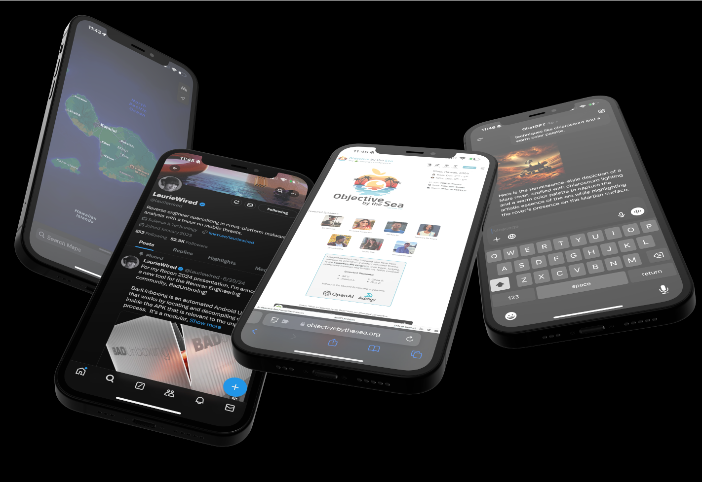

---

---

# iDecompile: Writing an iOS Decompiler

During this talk, I discuss how to decompile and reverse engineer iOS applications across multiple platforms rather than only on MacOS. Generally iOS applications require multiple native Mac tools for decoding both the instructions and the resources. Not only that, but native application languages like Swift and Objective-C are improperly reconstructed when decompiled on platforms like Windows and Linux. Programmatically decoding each resource type and reconstructing class structures from mangled names produces a much more complete view into the original application structure.

## Malimite iOS Decompiler Repository
The [Malimite](https://github.com/LaurieWired/Malimite) repository contains the release and source code for my iOS decompiler. This tool builds on top of Ghidra to offer custom support for reverse engineering iOS applications.

## Pillars of iOS Reverse Engineering
- Permissions
  - Info.plist
  - Embedded.mobileprovision
- Resources
  - Plists
  - Localized strings
  - Nib / xib
- Executable
  - Main Mach-O binary
  - Universal binaries
- Libraries / Frameworks
  - Bundled library code
  - Differentiating user / lib code

